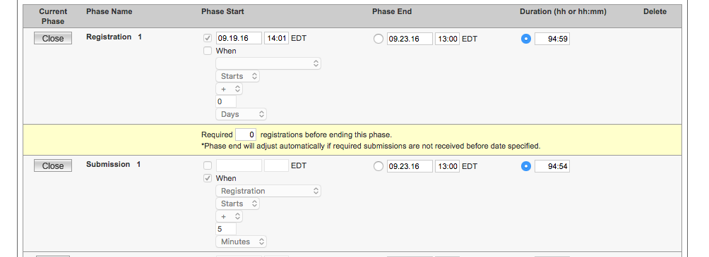
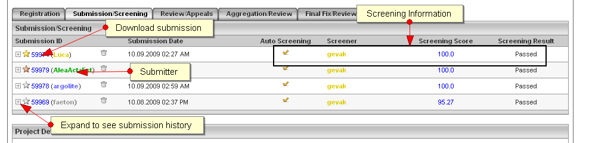

# **Dev Copilot Role & Responsibilities**

# Overview

What is a Copilot?

A highly respected and skilled Topcoder member who has passed a certification process and is responsible for running challenges to produce the best outcome.  

The copilot receives it name originally from an airplane copilot who is responsible for helping the main pilot with flying the plane.  But just like in the airlines, a copilot is the first officer and is *not *an apprentice or sidekick but shares flying duties equally with the pilot.  Both roles can fly the plane and take part in the decision making.  This is no difference here, copilots along with the client and architects drive the project to success.

## Primary Responsibilities

* Write challenge specifications

* Launch challenges

* Provide technical consistency between challenges

* Reduce risk in challenges

* Monitor challenge health

* Interact and support the community for all of challenges they launch

* Communicate accurate status reports to challenge owners.

* Manage budget

* Manage timelines

* Manage deployment of the application

* Spot check reviewers and submissions

* Extract and clarify requirements from challenge owners

* Manage source control

## Expectations of Deliverables and Outcomes

The copilot is responsible for the successful delivery of a challenge or set of challenges.  At the end of each challenge, the copilot should answering these vital questions:  Were the requirements met?  Did we deliver what we set out to implement?  This includes fully documented, tested, and deployable code.

## Time Investment

Copilots are expected to drive projects to completion.  This includes analyzing specifications and projects, running challenges, building and deploying applications and supporting development inquiries.  

Supporting a challenge we estimate takes

* 2-4 hours writing a challenge specification

* 2 hours a day supporting forums during submission phase (this might be short)

* 2-4 hours reviewing the output of the review phase and deploying an application

## Performance Evaluation

<table>
  <tr>
    <td>Delivery of materials on time and according to gameplan</td>
  </tr>
  <tr>
    <td>Challenge price point comes in on budget and in line with other similar challenges</td>
  </tr>
  <tr>
    <td>Challenge fulfillment</td>
  </tr>
  <tr>
    <td>Customer satisfaction</td>
  </tr>
  <tr>
    <td>Member satisfaction (clarity of spec, communicating important information, quality of spec, responsiveness within SLAs for forum questions, etc.)</td>
  </tr>
  <tr>
    <td>Reviewer satisfaction</td>
  </tr>
  <tr>
    <td>Project Copilot satisfaction</td>
  </tr>
  <tr>
    <td>Challenge Manager/Architect satisfaction (quality of spec, matching requirements, etc.)</td>
  </tr>
</table>

# The Copilot Mindset

The copilot is the leader!  You are the equal partner of the client running the project.  Together you will set the course and direction to produce a fantastic outcome.  

## Being a Copilot

This is a prestigious position.  Only the best are invited to this role and are entrusted with working with Topcoder's clients and their confidential projects.  Not only are you responsible for delivery for the client but also producing quality opportunities for the rest of the Topcoder community.

## Working with the Community

Your job is to guide the community to the best outcomes possible for a challenge.  You'll help support and nurture the community to work on your challenges.  Additionally, you'll constructively provide feedback and guide them through the submission process.  Lastly, you'll provide the final job as reviewer and arbiter to make sure the community produces high level of outcomes.

## Working with the Customer

Your job is to help guide the client along the correct path.  At the end of the day we need a successful outcome and your job is to steer the team in that direction.  You will need to be respectful and listen to the customer but your job is not to do exactly as the customer requests if those instructions would put the project in jeopardy by increasing timelines, exceeding budgets and/or adding risky technology decisions.

## Code of Ethics

Do not provide favoritism to any one member.  Treat all the members the same.  Do not provide any information to a competitor that is not provided to all competitors.  Be honest, do not try to make the situation sound better than it is.  Always tell the whole story including all issues with any clients.

In addition to the above, you are expected to always comply with our standard [Terms](https://www.topcoder.com/community/how-it-works/terms/) and [Code of Conduct](https://www.topcoder.com/community/topcoder-forums-code-of-conduct/). Failure to do so may result in loss of the position and suspension or expulsion from the community.

## Secrets for Success

* Communicate, communicate, communicate!  Don't be afraid to communicate to everyone and anyone.

* Push to get work done sooner and launch challenges sooner.  You can always clean up mistakes later but harder to get back missing time.

* Use [continuous ](https://en.wikipedia.org/wiki/Continuous_integration)[integration](https://en.wikipedia.org/wiki/Continuous_integration) to build often and faster!

    * Decreases integration time

    * Code review becomes easier

    * Decreases merging

    * Puts code in the hand of the clients faster.

    * Run tests and make sure code coverage is there

    * Test earlier and find bugs earlier!

* Include **more** testing.  Add more testing to your gameplans.  Don't wait to the end to test and find bugs.  Do it as often as possible.  Ideally every 2 weeks

* Provide milestone releases.  Release versions to QA as soon as you can.  Ideally you don't go longer than 2-3 weeks without a deploy.

* Give clear and concise statements about what is required and expected in all forum interactions.  Ambiguous statements make it hard for members and reviewers to set the appropriate expectations.

* View submissions early!  If someone submits early, take a peek.  It is a great feeling to know you are going to have at least one working solution and it will help to manage customer expectations and timelines.

* Know your [development challenge types](https://help.topcoder.com/hc/en-us/articles/217481558-Development-Challenge-Types)!  It is also good to review the different design challenge types and [data science challenge types](https://help.topcoder.com/hc/en-us/articles/230881408-Data-Science-Challenge-Types) in case you need to recommend using one of those types instead.  Don't worry you would get additional help from a trained copilot for those types.

# Applying for Opportunities

**Development Challenges**

You will be added to a copilot list.  A topcoder employee will email you and offer you positions.  Please email the employee any questions and review the opportunity.  Afterwards, you can an accept or reject the opportunity over email.

**Connect V1**

As a Connect Copilot you will be added to Topcoder Slack.  You will see a channel called connect-copilots

You will see admins posting projects and you can reply if you are interested right in slack to be assigned. Before accepting, please view the link for the requirements and technologies used.

**Connect V2**

**TBD**

# How to Perform the Copilot roles

## Signing an NDA and Terms

1. If you would like to be considered as a copilot for NDA based challenges.  Please make sure you have completed this NDA

    1. [https://www.docusign.net/member/EnvelopeSetupTab.aspx?ti=a086d4f2bd4d42b8be116f6ff5a2fa7d](https://www.docusign.net/member/EnvelopeSetupTab.aspx?ti=a086d4f2bd4d42b8be116f6ff5a2fa7d)o

## How to Create a Gameplan for Development

NOTE: There needs to be a lifecycle management section. Gameplan creation only happens once.

Gameplans, or project plans, are created at the beginning of the project as a project is being scoped for both cost and duration. Gameplans can be created as follows:

### Requesting a new quote

1. In slack type the slash command "/quote" followed by the name of the project.

2. Chose a name for the quote that makes it unique like the project name

3. After the command is typed, the quote is created and the slack window will be updated with a link to the quote

4. Click the link and log into Smartsheet. Be sure to login to smartsheet with the same email as your slack account.

5. Once you’ve logged into smartsheet you will be presented with a blank quote in smartsheet.

### Editing a new quote

Once a new quote has been created you can edit the quote in smartsheet to build out a Gameplan. The following columns in the smartsheet are important for building this game plan

1. Task Description - The task description is the name or title of the challenge. This should be a descriptive name of the challenge but not too long that it will wrap in direct. A good challenge name should have the project name embedded in it as well.

2. Start - This is the date when you plan to have the challenge start. Many challenges will have this date set automatically based on dependencies of previous challengs.

3. End - This is the date when you plan to have the challenge end. This is related to the start date and the challenge duration.

4. Duration - This is the number of days the challenge is planned to run. Duration, Start Date, and End Date all work together, You can only update two of the three, the other is calculated. If you change the duration, the end date will automatically change. If you change the end date, the duration will change.

5. Average Duration is a field based on historic data for this challenge type.

6. Predecessors - This shows the dependencies of a challenge on another row.

7. Inputs - This defines the expected inputs for a given challenge.

8. Outcomes - These are the planned outcomes of a given challenge

9. Challenge Type - one of:

    1. Design-Wireframe

    2. Design-MobileStoryboard

    3. Design-WebStoryboard

    4. Design-Ideation

    5. Design-Prototype

    6. Design-F2F

    7. Dev-Assembly

    8. Dev-Code

    9. Dev-F2F

    10. Dev-BugHunt

    11. Design-Prod-Wireframe

Challenge types are prefixed by the challenge community they belong to.

10. Challenge Size - one of :

    12. small

    13. medium

    14. large

## Writing a specification

1. Review all project documentation and deliverables

2. Communicate all questions with other team members including clients.

3. Review how to write a good spec tutorial

4. Launch the challenge

    1. Through Topcoder Direct

        1. Log into [http://topcoder.com/direct](http://topcoder.com/direct)

        2. 

        3. Chose your project name and billing account

        4. Schedule your start date and submission date as well as the challenge type.

        5. For review type select community or internal (only use this if you are reviewing or the client.

        6. 

        7. Insert your requirements and overview here

        8. 

        9. You must select your technology

        10. Upload any **PUBLIC** files here. Any private challenges must be uploaded to the forums after the challenge has been created.  These files are **OPEN to EVERYONE,** even unregistered members.

        11. Adjust prizes, usually the defaults are fine but you have the flexibility to change them.

        12. You can use the preview button to see what your challenge looks like.

        13. Click **Save as draft** or continue.  Once you click **Continue** you also need to click **Activate** to make it live!

    2. Through Glib

        14. https://help.topcoder.com/hc/en-us/articles/225540228-Topcoder-Integration-with-the-Topcoder-Chrome-Extension

## Assembly vs Code vs Jira Task vs F2F

First review all of the different challenge types: [https://help.topcoder.com/hc/en-us/articles/217481558-Development-Challenge-Types](https://help.topcoder.com/hc/en-us/articles/217481558-Development-Challenge-Types)

* **First To Finish** (or F2F) is used when you need code quickly and the task is well defined and typically is a small amount of work.

* **Assembly** challenges are used when you know what the expected output is.  These challenges include final fixes.

* **Code** challenges are used for more creative iterative challenges.  Final fixes are not included and any follow on changes should be rolled into the next challenge.

## Reviewing your challenge

1. Confirm you have access to the competition management system called Online Review or OR. Log into online review at http://software.topcoder.com/review

2. You will now see My Open Projects and click on the appropriate challenge

3. Verify Competition details by clicking on the challenge name in the previous menu and verifying your dates are correct.  You will also notice in green the highlighted phase specific tabs for this challenge.

4. At the bottom of the page you will notice the Project details and team members.  You will see Topcoder staff assigned as orange handles.

5. 

6. You can now click the forum link in the top right hand menu.  This will take you to the forums. This will ensure you have access to the appropriate forum and you will want to click watch to receive email notifications.

7. 

8. **HINT: **this [link](https://apps.topcoder.com/forums//?module=Watches) will list all of your watched forums.  You can edit your preferences from there.

## Adding Team Members

1. At the bottom of your challenge in Online Review you can click "Manage Project"

2. 

3. Then you can enter observers or a designer to watch the project if you need help.

4. 

5. Optionally you can add other roles by click edit project and scrolling down the the roles section.

6. 

7. NOTE: This gives you more control, but the first one is simpler to use and will meet 99% of the use cases.

## Rules for Extending / Changing Timelines

1. If the submission phase is closed you CANNOT reopen the challenge unless there were issue with Topcoder's systems

2. If the submission phase is not closed you can extend for the following reasons

    1. Relevant forum questions have not been answered for more than 24 hours.

    2. Some of the relevant materials were provided late after the Submission started.

    3. There was a significant change in the requirements after the Submission started.

    4. There was a problem with TopCoder servers which prevented competitors from working on the contest.

    5. Extensions will not be added in the last 24 hours.

3. Minimum extension time frame is 24 hours.

4. Tips and Tricks

    6. Usually a failed challenge has an issue.  Best bet is to post to the forums find out why people are not participating and repost

    7. Relaunch the challenge as a F2F or with a short timeline if you think someone will submit

    8. Ask members to submit even if they think they will fail.  You still might be able to use a failed submission see [Failed Submissions](#heading=h.516kb0uw6qzg) section.

## Changing Timelines

1. In your project click Edit Project button

2. 

3. Now you can see all the phases in the timeline section

4. 

5. Changing the duration in terms of number of hours or hours:minutes will change the timeline for the current phase by adding that time to the start date of the phase

6. Alternatively you may click the button next to phase end and enter an EXACT time the phase should end and the phase will end based on that time.

7. Reopening phases is not possible in this tool, you must contact [support@topcoder.com](mailto:support@topcoder.com) to reopen a phase if necessary.

## Managing Git Source Control

1. Review the great article by [Vincent Driessen](http://nvie.com/about/) on git flow here: http://nvie.com/posts/a-successful-git-branching-model/

2. We follow the Git Flow process (NOTE: not Github Flow)

3. Branching Model Setup (gitlow style):

    1. Master Branch (default in most cases) used for releases only. Version Tags should be applied at release time.

    2. Develop Branch (branched from master) used for active development line and candidate releases (tags)

    3. Create Feature branch based on each feature being developed.  Follow the convention of prefixing the name of the branch with the challenge id.

4. Mark all branches as protected.  This will prevent members from overwriting branches.  

5. Each member will fork and issue Pull/Merge requests against

6. Merging:

    4. After accepting the winning submission merge request into feature branch merge the feature branch into the "develop" branch after performing integration testing.

    5. Proper gitflow usage dictates using the --no-ff option to prevent "fast-forwarding" of commits.

7. Releases:

    6. Release candidates should come from the "develop" branch and be tagged as such.

    7. Merge "develop" into the “master” in preparation for release (--no-ff)

    8. Releases should be pulled from the "master" branch only

    9. Tag the "master" at each major release (with version number/name)

## Forum Support

1. During the competition it is important for the copilot to manage and monitor the forums.  We recommend you at least answer questions twice a day at 8 am and 8 pm your time. Topcoder's commitment to members is to provide them an answer within 24 hours of their post.  If questions are unanswered for a long period of time most likely the question poster and other members will not participate in the challenge.

2. Remember all responses here become part of the challenge requirements.  Be clear and concise in all answers.  Do not leave things ambiguous.

## Registration Phase

1. Copilots will monitor member registration during this phase.  In Online Review, you can view the registration tab to view who has registered for the challenge.  

2. 

3. You will want to make sure you have a mix of members who are active.  By clicking on their name you can view their profile to see what challenges they have worked on and how active they are at Topcoder.

4. This is also a good time to view the forums to see who has been answering questions.  If there are no questions, you may need to reach out to the members.

5. If the track is rated, you will be able to view the ratings for those members in the track.  See more about ratings:

6. Reliability is used for a few tracks.  It measures how often a member submits a passing submission when they register for a challenge.  See more about reliability: [https://help.topcoder.com/hc/en-us/articles/219240797-Development-Reliability-Ratings-and-Bonuses](https://help.topcoder.com/hc/en-us/articles/219240797-Development-Reliability-Ratings-and-Bonuses)

7. TIP: If a member submits early you can view their submissions in the submission and screening tab and download the submission to view it.

## Increasing Registration for a Challenge

1. Topcoder sends newsletters to all members on a weekly basis.  You can contact [support@topcoder.com](mailto:support@topcoder.com) to request that your challenge be listed.

2. Support will also help add your challenge to our social media rotation of posts.

3. Plug your challenge in the [General Development Forums](https://apps.topcoder.com/forums/?module=ThreadList&forumID=205768&mc=48763).

## The Submission/Screening Phase

1. In online review you can view all of the submissions.  This tab is accessible as soon as the submission phase opens.

2. By clicking the submission number, you can download the latest submission.  

3. The plus symbol expands to see earlier submissions

4. 

5. If screening is enabled for this phase, you can view the scorecard and status if it is completed.  

## The Review Phase

1. In online review you can view all of the submissions.  This tab is accessible as soon as the submission phase opens.

2. By clicking the submission number, you can download the latest submission.  

3. The plus symbol expands to see earlier submissions

4. 

5. If screening is enabled for this phase, you can view the scorecard and status if it is completed.  

## Expectations for the Final Fix Phase and Code Challenges

1. For code this is easy, there is no final fix phase.  You should not expect members to implement final fixes.  This is accomplished with a follow on task or challenge.

2. For assembly challenges, any items that were in the requirements and were not implemented are fixable if they were identified as part of the scorecard.  If a member does not implement these fixes 25% of their payment may be held and used to task someone else to implement these fixes.

## Failed Submissions

1. If a challenge fails and doesn't receive any passing submissions it does not have to end there!

2. Review the submissions and review the scorecards

3. Do any of the submissions get you to a great starting spot?  

    1. If yes, offer them second place prize money and use that code as the building blocks to a follow on challenge

    2. If not you will need to restart a new challenge.

## Support during the competition

1. During the competition if you need any support around your challenge there are resources to help you.

2. Click contact managers to contact Topcoder Staff

3. 

## Running a bug bash from Source control

1. Account/Access Structure:

    1. Unless required, repositories will be private by default

    2. Create team/group based access to repositories

        1. Member group access includes:

            1. receive read/write access to repository

            2. ability to create tickets

            3. ability to self-assign tickets

            4. ability to add and remove tags from tickets

            5. repo user should equate/tie to platform user

        2. Manager group access includes:

            6. receive read/write access to repository

            7. ability to create tickets

            8. ability to self-assign tickets

            9. ability to create wiki pages

            10. administrative control over repo

            11. repo user should equate/tie to platform user

    3. requisite teams applied to groups of repos for visibility over other components of a project.

2. Follow proper branching (see earlier topic)

3. Challenge Setup:

    4. In your challenge, ask the community to email you/co-pilot and request access to the project group ("Goliath National Bank Team") by sending their username.

    5. Create your challenge as a code challenge.  You should provide an overview of the app and advertise your project here.  Provide link to SCM.

    6. Add community member to the group  (example name "Goliath National Bank Team") with “Developer” access only. This allows them to create tickets, fork the repo, and create branches but will not allow them to touch protected branches. Note: this level of access is a concept from Gitlab that does not exist in Github currently. See [https://gitlab.com/help/permissions/permissions.md](https://gitlab.com/help/permissions/permissions.md)

    7. Have member add challenge managers to their private branch as a master and reviews as reporter. Note: this level of access is a concept from Gitlab that does not exist in Github currently.

4. Submission Process:

    8. Require community members to fork the project at the feature branch to acquire the current code base. This will allow for concurrent challenge running as each branch is a separate challenge.

    9. Two options for gaining access to code are available.

        3. Require submissions of code by through a merge request.  The only issue with this method is that the code can be viewed in a "diff" of the merge request. This is the prefered method, unless privacy is a concern use the second.

        4. Require that the managers & reviewers be added to the private fork as a member. This is not exactly the ideal automation but it does get around the visibility of the code in the merge request diff.

5. Review Process:

    10. Test pull/merge request submissions locally before accepting.

    11. If submission passes, accept merging into feature branch.

    12. If submission fails, reviewer can make comments directly against code or merge request ticket.

6. Wikis:

    13. Wikis should be utilized extensively as a central repository for project information.

    14. Types of information include:

        5. Project description

        6. Setup guides

        7. Reference materials

        8. "Bug Bash" instructions

        9. Challenge detail listings

7. Issues List

    15. Issues lists can be utilized for general bug tracking as well as "Bug Bashing"

    16. Members can be alerted to issue tickets by utilizing the @all/@organization/team-name mention

    17. Bug Bashing Process

        10. Create the following tags on the repo:

            12. "_OPEN FOR PICKUP" denoting ticket is available to members to self-assign

            13. "_READY FOR REVIEW" denoting that a member has completed the requested work

            14. "_ACCEPTED" denoting managers have accepted ticket solution

            15. "_PAID" denoting ticket has been processed for payment

            16. "Priority X" where X is a value from 1 through 5 denoting Appirio triage priorities (1-Blocker through 5-Enhancement)

        11. Assign a priority label to tickets.

        12. Assign a "point" value to all tickets in the ticket title as a prefix.

            17. Points represent some fixed dollar amount designated by the managers

            18. As a general rubric, point values are a multiple or priority. ie: Priority 1 issues should be addressed first and thus should hold a higher points value than lower priorities. P1s == 4P, P2 == 3P, etc.

            19. The purpose of points is to create an arbitrary value for tickets that can be driven up and down on demand. For example, a weekend "double points blitz" can incent members to scramble and burn down tickets faster.

        13. Mention @all members that a ticket is available for pickup.

        14. Members self-assign tickets

            20. Only one ticket is allowed per member at a time.

            21. If a member has not submitted within 24hrs, the member forfeits the ticket and the ticket is unassigned.

            22. Member labels ticket as "_READY FOR REVIEW" once their submission is ready.

        15. After reviewing submission the manager/reviewer marks the ticket as "_ACCEPTED"

        16. After the manager has accepted the submission and process payment, the ticket is labelled "_PAID" and payment reference placed as a comment on the ticket.

## Running a F2F

1. [First to finish](https://help.topcoder.com/hc/en-us/articles/217481558-Development-Challenge-Types) works very similar to a challenge but the first person to submit can win.  

2. Typically the copilot will also serve as the reviewer here since you know what the solution needs to do.

3. Review the solution, provide feedback in the forum and/or scorecard.  If you fail the solution another solution may be right behind it.  After each solution is reviewed, another one is taken off the queue.  If a submission wins, the rest are ignored.  

4. Suggestions

    1. Use these for when you do not need variety in solutions.

    2. You should also know the expected outcome in advance.

    3. Total time spent on this work should be under 8 hours.

## Running Jira Tasks

While Topcoder Direct is a powerful tool, there are times when work or tasks are done outside of the platform and there is a need to pay a member directly. This will document that process.

**Pre Requisites**

When you create a ticket in JIRA for payment, the processor needs to know which project, and thus which billing account, to charge the work to. You will need:

* Project in TC Direct associated to at least 1 valid Billing Account

* A JIRA project

* Handle of the member you are paying

**Creating a ticket**

1. Navigate to your JIRA project.

    1. NOTE: JIRA allows you to create components within your JIRA project. If you plan on running multiple projects out of your JIRA instance, or would benefit from being able to segment your tasks, consider using these (but not required by tool).

2. Select "Create Bug" link

3. The following fields are required in the default JIRA form:

    2. Summary - Short description of task; this will show up in your customer's invoice so choose words wisely

    3. Reporter - Whoever logged the issue - could be copilot or you.

    4. First Place Payment - Amount of the member payment. Does NOT include markup.

    5. Cockpit Project ID: This is the unique ID of your project in Topcoder Direct. If you are viewing your project, you can see it in the URL where the project id is XXXXX [https://www.topcoder.com/direct/projectOverview.action?formData.projectId=XXXXX](https://www.topcoder.com/direct/projectOverview.action?formData.projectId=XXXXX)

    6. Payment Status: Must be set to "Payment Owed" to be picked up by the payment processor.

    7. Select "Create" button to create the ticket.

    8. When ticket is ready to be paid, the final step is to "Resolve" the ticket in JIRA. This and the "Payment Owed" setting are what flags the ticket for the payment processor.

**Best Practices**

1. Use the *Description *field to store the details of task performed to justify the payment. If the work was done in an external system, include links to the work here. Remember: this is work the customer will be invoiced for, so if questions arise when they are reviewing for payment, you'll want to have links to the details already in place.

2. Use the *Components *field to help segment work done for different projects on the account (if applicable).

3. Power move - include the Topcoder Project ID in the Components name - i.e. *MobileApp1-10123*. One of the more common mistakes is entering the wrong project ID and invoicing the wrong billing account - this can help prevent that.

## Managing a bug hunt

1. Bug Hunts are different then most contests on topcoder.com - in that the reviewer is not assigned to the contest from the review pool, instead, the reviewer is the copilot. Copilots are responsible for reviewing all issues & managing the contest. This includes:  

    1. Modifying the contest timeline in OR so that the first 24 hours of the contest is a a registration period, and posting in the contest spec / forum that no one can submit any bug.

    2. During the registration period, providing a link to the deployed app or a link + instructions on building / deploying the code. This is done in the contest forum.

    3. After the submission phase ends:

        1. Reviewing every defect and verifying that it’s valid.

        2. Rejecting duplicate issues (the ticket submitted first is logged against the total for a submitter).

        3. Determine if the issue reported constitutes an acceptable issue (spelling / grammar, layout / UI, functional defect, etc).

2. All defects that are logged by members must include the following:

    4. Environment

    5. Steps to reproduce

    6. Outcome vs. Expected Outcome

    7. Screenshot or Video

3. In addition, participants must take the following under consideration:

    8. Before logging an issue, they must ensure that there is no similar issue already logged.

    9. Issues must be clearly described. They must reference a test case (perhaps a video reproducing the issue or a document with steps on how to reproduce the issue) along with the expected vs actual results in order for the issue to be counted.

    10. If an issue is not properly documented, we may reject it and it will not count.

    11. If an issue is seen in multiple screens & logged as multiple issues, they will only count as one. Others will be marked as duplicate.

    12. The first participant to find an issue gets the credit - duplicate issues will not be counted.

# Copilot Payments

## How Payments are Calculated

Payments are made based on the successful completion of the challenge. The payment is displayed once a draft is created in Direct.  On the challenge page in direct, scroll down to the prizes section and view the payments section

## When Payments Are Made

Payments follow the standard topcoder challenge payment process detailed in the help center: [https://help.topcoder.com/hc/en-us/articles/217482038-Payment-Policies-and-Instructions](https://help.topcoder.com/hc/en-us/articles/217482038-Payment-Policies-and-Instructions)

## Penalties

A copilot is **not compensated for failed challenges.**

# Applying for Being a Dev Copilot

## Eligibility Requirements

Verify that you meet all eligibility requirements before applying. To apply to be a Development Copilot, you must have:   

* Won 3 development challenges in any technology

* Passed review in 3 challenges in the specified skill/technology for the challenges you wish to copilot

* Submitted to 1 Bug Hunt/Bash

* Submitted to 1 First to Finish

* Posted 25 times in the Topcoder forums

* Not been suspended for any reason in the last year

## Minimally Qualified Candidate Description

[Take from the Blueprints/MQCs]

## How to Apply

If you meet the minimum requirements and are interested in applying, complete the application form located [here](https://docs.google.com/a/topcoder.com/forms/d/1A1Ehoy2O7PZvU6iNcc_gBh_qzv5na4uLisBfkby7QSc/edit).

Applications are accepted at all times. Applications will periodically be reviewed in the order received when Topcoder is ready to add new members in this role. If you have a question about the next expected review period, please contact Topcoder Support.
